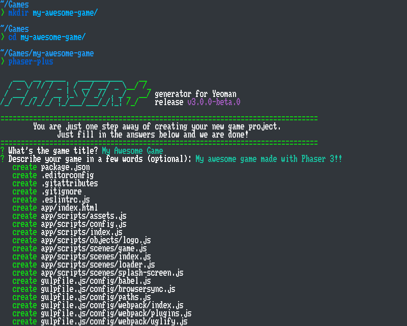
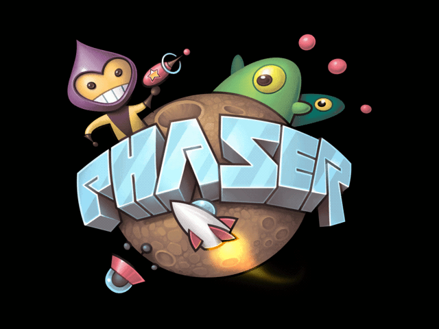
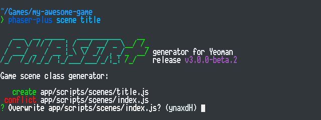
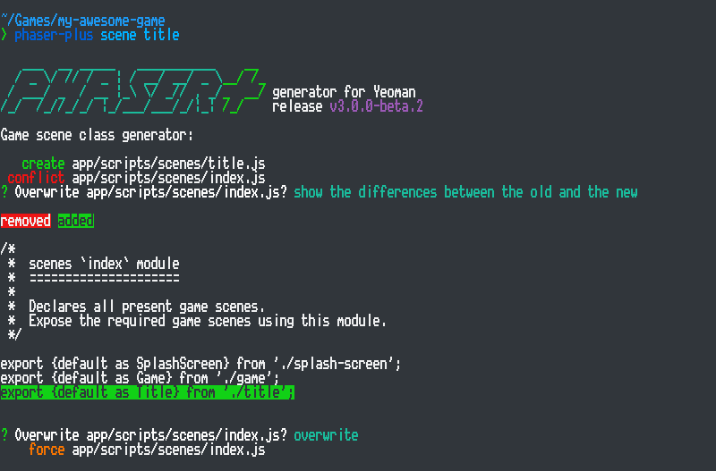
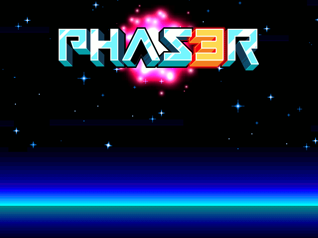
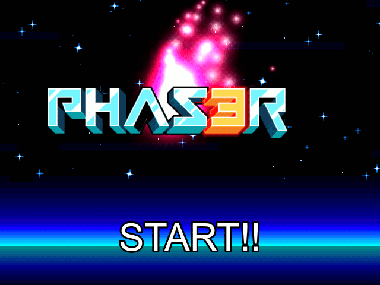

<div align="center">
    
    <div>
        <a href="https://www.npmjs.com/package/generator-phaser-plus">
            
        </a>
        <a href="https://david-dm.org/rblopes/generator-phaser-plus">
            
        </a>
        <a href="https://david-dm.org/rblopes/generator-phaser-plus?type=dev">
            
        </a>
        <a href="https://travis-ci.org/rblopes/generator-phaser-plus">
            
        </a>
    </div>
</div>

>   Create Phaser Web games with ease.

`generator-phaser-plus` is a [Yeoman generator](http://yeoman.io/) that makes starting up [Phaser 3](http://phaser.io/) game projects dead simple.


## Table of Contents

-   [Installation and Usage](#installation-and-usage)
    -   [Create a New Phaser Game Project](#create-a-new-phaser-game-project)
    -   [Generators](#generators)
-   [A Brief Tutorial](#a-brief-tutorial)
-   [Project Setup](#project-setup)
    -   [Features](#features)
    -   [Application Layout](#application-layout)
    -   [Development Tasks](#development-tasks)
    -   [Configuration](#configuration)
-   [Miscellaneous Topics](#miscellaneous-topics)
    -   [Managing Dependencies](#managing-dependencies)
-   [Contributing](#contributing)
-   [Release Notes](#release-notes)
-   [License](#license)


## Installation and Usage

>   **NOTE**: Assuming you have at least the latest [Node.js](https://nodejs.org/) release with [long-term support](https://nodejs.org/en/about/releases/) installed.

Download and install `generator-phaser-plus` from npm, using either `npm` or [Yarn](https://yarnpkg.com/).

**New on `v3.0.0`**: Installing Yeoman to use `generator-phaser-plus` is completely optional.

```sh
npm install --global generator-phaser-plus
```


### Create a New Phaser Game Project

1.  First, create a new directory to keep you project contents and go into it.

    ```sh
    mkdir my-awesome-game/
    cd my-awesome-game/
    ```

2.  Run `phaser-plus` and fill in the short questionnaire.

    ```sh
    phaser-plus
    ```

    

3.  After the installation of the development kit finishes, fire up your project running:

    ```sh
    npm start                           # Or: `yarn start`
    ```


### Generators

`generator-phaser-plus` comes with a few handy generators to speed up some common Phaser game development tasks.

>   **HINT**: You can read a short description of what a command does running it with the `--help` option.

#### `object` generator

```sh
phaser-plus object <name>
```

Creates game object classes. This generator will ask which Phaser game object class your want your new game object class to extend from.

-   **Alias**: `o`.
-   **Arguments**:
    -   **`name`**: The object class name. Required.

#### `plugin` generator

Beginning with release 3.8.0, Phaser enhanced its plugin manager and added support for two kinds of custom plugins: Global Plugins and Scene Plugins.

Global plugins are instantiated once and persist throughout the whole game session.

Scene plugins are instantiated with each scene, and each instance is tied to its host scene life cycle.

`generator-phaser-plus` can create the blueprint of a custom Phaser plugin to use with your games. If you need to add some extra functionality to your game, for example, integrating an external library into Phaser, you can achieve that using a custom plugin.

To create a custom plugin, use the following command:

```
phaser-plus plugin <name> --type <global|scene>
```

-   **Command Alias**: `p`.

-   **Arguments**:
    -   **`name`**: The plugin class name. Required.

-   **Options**:
    -   **`type`**: Alias: **`t`**. The kind of plugin to generate. Can be
        either `global` (the default) or `scene`.

#### `scene` generator.

```sh
phaser-plus scene <names...>
```

Creates scene classes and updates the `scenes/index.js` module with the new entries.

-   **Alias**: `s`.
-   **Arguments**:
    -   **`names`**. Required. The name (or names) of the scene class.


## A Brief Tutorial

This step-by-step tutorial takes the official [game example](https://github.com/photonstorm/phaser#create-your-first-phaser-3-example) as a starting point to guide you through `generator-phaser-plus` workflow.

The tutorial is written from an absolute beginners perspective, but assumes the user already have a little understanding of JavaScript syntax. Also, some previous Node.js development experience and some reasoning around the terminal emulator and command-line tools is desirable but not a necessary requirement to complete the tutorial.

> **NOTE**: Some portions of sample code are formatted using a simplified ['diff' format](https://en.wikipedia.org/wiki/Diff_utility). If you are not familiar with that format, keep in mind that whenever you see a line beginning in a plus (+) sign, you should add that highlighted line to your code. Conversely, lines to be deleted begin with a minus (-) sign.


### First steps

When you fire up your game project for the first time, you should see a floating Phaser 3 logo rotating on your browser.

<div align='center'></div>

Your new game project is alive. We are ready to start producing some code and add the necessary parts to create a real game ─ that is, one that is more than just a spinning logo. Open up your game project in your favorite code editor or IDE, if you did not do so already, to start editing it.

#### Your first game scene

We will start by creating a new "Title" scene, using the [`scene` generator](#scene-generator).

To add that new game scene to your game project, run the following command:

```
phaser-plus scene title
```

That command will execute the `scene` generator to create a stub of a new Phaser Scene class. A scene is where all action in a Phaser game happens. For example, we use scenes to manipulate physics, update the game logic, process player input, display the player's score and so on.

The scene we are creating here will be named `Title`, and will serve as your game's title screen, with a simple "Start Game" button. Its code will be contained in a file named `title.js`, under the `app/scripts/scenes/` directory.

<div align='center'></div>

Immediately after you hit <kbd>Enter</kbd>, the generator will create your new scene file but will halt for a moment. This is OK. The generator is now trying to update the scenes index (the `app/scripts/scenes/index.js` file) so you don't have to do that manually. Because it is modifying an already existing file, the generator gives you the opportunity to review these changes. To see which lines are being added to that file, just type <kbd>D</kbd>, followed by <kbd>Enter</kbd>, to get a preview of the changes. When you finish reviewing, or just want to proceed anyway, type <kbd>Y</kbd> and <kbd>Enter</kbd> to answer "Yes" and confirm.

<div align='center'></div>

Now that you added a new scene it is time to start using it. For that, you need to do a small update on the scene responsible for defining the game's splash screen appearance.

The `SplashScreen` class takes care of a few chores. First, it tells Phaser which media assets it must load. Meanwhile, it displays the cover art of your game and a progress bar telling the player how much time for the game engine to finish performing its initialization tasks remain before it can actually start running the game itself.

When all media assets finish loading, it starts the Game scene, with the rotating Phaser logo we saw earlier. You want to change that so the game jumps to the Title scene instead. Open the `app/scripts/scenes/splash-screen.js` file and find the `create` method. Modify it as in the highlighted code excerpt below, so the `this.scene.start()` method argument reads `'Title'` instead of `'Game'`, and save it.

```diff
 create() {
   //  We have nothing left to do here. Start the next scene.
-  this.scene.start('Game');
+  this.scene.start('Title');
 }
```

Done. Now you will be left with a boring black screen. Don't worry, though, things are about to get interesting soon. Let's take a moment, though, and discuss one important aspect of your game project.

#### Declaring game assets

The crafting of a game requires not only code. In your project, to ambient your virtual world, you will need to use many kinds of media files, collectively known as game assets. Game assets come in a wide range of types, including:

-   Artwork, like graphical textures and three dimensional models;
-   Audio files for sound effects and background tunes;
-   Many sorts of miscellaneous files defining raw data, like level definitions, board maps and many more.

To use these media assets in your game, however, Phaser must know what kind of files it needs to load so they can be processed and committed into the browser's memory.

To save time, `generator-phaser-plus` projects follow a simple pattern: You copy files to the `app/static/assets/` directory and declare them in the splash screen scene `preload()` method body.

>   For this part of the tutorial, we are going to use some files from the Phaser Labs.
>
>   -   [The starry sky (`space3.png`)](http://labs.phaser.io/assets/skies/space3.png)
>   -   [A red flare (`red.png`)](http://labs.phaser.io/assets/particles/red.png)

<!-- TODO: Hot-linking is BAD! I need to prepare, or as a last resort, reuse, one archive containing all needed sample assets to go along this tutorial, before the final version of the generator is published. -->

After you copy the files to the assets directory, let's declare them. Find the `preload()` method in the splash screen scene class and modify the highlighted lines as follows:

```diff
 //  HINT: Declare all game assets to be loaded here.
-this.load.image('logo');
+this.load
+  .image('logo')
+  .image('sky', 'space3.png')
+  .image('red');
```

<!--
>   **NOTE**: Windows users should be a little careful relying on this convention because some graphics editors insist on using capitalized extensions (e.g.: `some-name.PNG`) when saving files, however Web browsers do distinguish capitalized and minuscule characters on file names.
-->

#### Adding the background to the Title scene

After adding your first media assets, you can start adding the elements of our Title scene. Let's start with the background. Inside the `create()` method body, type the following code block and save the module.

```js
//  Save the center point coordinates for later reference.
const x = this.cameras.main.width / 2;
const y = this.cameras.main.height / 2;

//  Add the starry sky background.
this.add.image(x, y, 'sky');
```

In Phaser 3, textures have its origin point set at the center coordinate. We will match that origin point with the center of out game screen.

#### Creating a flame effect

Let's add a fancy flame effect to the scene. For that, write the following code below the one we added for the background image and save.

```js
//  Create and start an particle emitter.
const flameParticle = this.add.particles('red');
const flame = flameParticle.createEmitter({
  speed: 100,
  scale: { start: 1, end: 0 },
  blendMode: 'ADD'
});
```

With that, we create a particle emitter. First, we tell Phaser which texture to use as the elementary particle. Then we start the emitter: the parameters tell how long the particles will be visible, starting large and scaling down until they completely disappear. The `blendMode` is the final touch, giving the texture a bright pink flame effect.

However, our flame is stuck to the top left corner now. We will fix this shortly.

#### Adding the 'Phaser 3' logo

Add this new code snippet below the flame particle emitter effect code.

```js
//  Add the 'Phaser 3' logo.
const logo = this.add.image(x, 100, 'logo');

//  Attach and make the emitter follow the logo.
flame.startFollow(logo);
```

<div align='center'></div>

That will add the Phaser 3 logo near the top of the screen, with the flame effect attached behind it.

#### Making the logo bounce around the screen

Our title screen looks cool already, but what if we made it more animated? We could go a little overboard and use physics simulation to make the logo bounce around the screen, why not?

Phaser 3 comes with a selection of features out-of-the-box. Some of those, however, require some tweaking before they can be used in full. The configuration module (`app/scripts/config.js`) is where the parameters of some Phaser features are kept.

Take a moment to examine the contents of that module if you like. That module contains several tweaks that can be adjusted according to you project needs.

To enable physics simulation, uncomment the `export const physics` line and modify it, like shown below.

```diff
 //  Enable physics simulation and configure parameters. Available  systems are:
 //  - `arcade`: Phaser Arcade Physics 2;
 //  - `matter`: Liam Brummitt's (@liabru) Matter.js;
 //  - `impact`: ImpactJS Physics Engine.
-// export const physics = {};
+export const physics = {
+  default: 'arcade',
+  arcade: {
+    gravity: {y: 200}
+  }
+};
```

This instructs Phaser to enable the Arcade Physics Engine upon initialization with the given parameters and set it as the default physics engine.

Now, back in the Title scene code, let's replace the lines where the logo is added. To give the logo physics properties, we have to make some adjustments.

```js
//  Add a bouncing Phaser 3 logo.
const logo = this.physics.add.image(x, 100, 'logo')
  .setVelocity(100, -100)
  .setBounce(1, 1)
  .setCollideWorldBounds(true);
```

Note that we are using `this.physics.add.image(/* ... */)` instead of `this.add.image(/* ... */)`. The difference is that our image now is managed by the physics engine.

Also note how we are chaining method calls to set the physics properties of the image. We are telling it to ascend momentarily before falling down and bounce up every time it hits the floor of the screen.

#### Adding a simple text button

To finish this part of the tutorial, let's create a 'Start' button using a simple text label.

```js
//  Add a text label.
const label = this.add.text(x, 400, 'START!!', {
  font: '64px Arial',
  color: 'white',
  stroke: 'black',
  strokeThickness: 6
});

//  Move the origin point to the center, make the label interactive.
label
  .setOrigin(0.5, 0.5)
  .setInteractive();
```

The first block of code defines the aspect of the text label, its coordinates and text.

In the second block, we move the origin point to the center of the label. Unlike other game objects, text labels have an origin point set at the top left corner. Also, we tell Phaser that this object will react to input interactions through a mouse or a touch screen.

But how do we know our button was clicked or touched, then? Game objects provide a mechanism known as event dispatcher. To explain that in a few words, game objects allow to _subscribe_ to certain events, providing the instructions to be performed when these events occur.

When a player clicks our "start" button, we want to show the "Game" scene, where all the game action will happen. Add the code below to enable the text button.

```js
//  When this label is clicked, move on to the next game scene.
label.on('pointerup', () => this.scene.start('Game'));
```

Here, we are subscribing to the `pointerup` event of the text label. When the text label is clicked, a `pointerup` fires immediately after the mouse button is released. When that happens, we tell Phaser scene manager to start the `Game` scene.

Now save the Title scene module. You should see a big white text label saying "START!!" on the lower part of the game screen. Click it ─ or, if using a mobile device, tap it ─ to be taken back to the "Game" scene, with the spinning Phaser logo, we saw earlier.

<div align='center'></div>

With that, we have created a fancy Title screen for our little game.

(To be continued...)


## Project Setup


### Features

Projects created with `generator-phaser-plus` have the following features out-of-the-box:

-   [Gulp](https://github.com/gulpjs/gulp/), a lean and simple task manager.

-   [Webpack](https://webpack.js.org/) for better integration of components and dependencies.

-   [Browsersync](http://www.browsersync.io/) for cross-device testing.

-   [Babel](https://babeljs.io/), with [`babel-preset-env`](https://github.com/babel/babel/tree/master/packages/babel-preset-env), for authoring scripts using the most recent ECMAScript specification features and syntax additions ensuring compatibility with current browsers and devices.

<!-- -   [ESLint](http://eslint.org/) for code quality check. -->


### Application Layout

Media assets and source code are organized in a dedicated `app/` directory.

```
app/
│
├── scripts/            # Where application modules are stored
│   ├── objects/        # Custom extended game objects
│   │   └── ...
│   ├── plugins/        # Custom private plugins
│   │   └── ...
│   ├── scenes/         # Game scenes
│   │   ├── index.js    # Reference module for all game scenes
│   │   └── ...
│   ├── config.js       # Contains certain Phaser configuration values
│   └── index.js        # The game application entry point routine
│
├── static/             # Static files served by Browsersync
│   ├── assets/         # Where game assets are stored
│   │   └── ...
│   └── favicon.ico     # A sample Phaser logo favicon
│
└── index.html          # Main page template
```


### Development Tasks

Automated tasks solve recurring development operations and help you prepare the application for distribution. A special `gulpfile.js/` directory contains the development tasks and its related modules.

>   **NOTE**: If you prefer, install the Gulp command-line interface:
>
>   ```
>   npm install --global gulp-cli
>   ```
>
>   Alternatively, the same tasks can be performed using the provided runnable scripts explained below.

There are two main development tasks:

-   **`default`** task. This is the main development task, the one you will interact with the most. This task uses Browsersync to start an interactive Web server to test your game in the browser. Under the hood, it uses Webpack to watch application modules for changes, triggering the necessary builds when changes occur. When a build finishes successfully, the page will refresh to show the updated game. It is configured to serve the application code and static assets.

    <details>
    <summary>Can be run with:</summary>

    ```
    gulp
    npm start
    yarn start
    ```
    </details>

-   **`dist`** task. The distribution task. When your game is ready, use this task to bundle the application code, its dependencies and static assets. It performs the following jobs, in order:

    -   Dispose the previously compiled version of your game, to avoid mixing outdated files.
    -   Recursively copy all static assets located under the `app/static/` directory.
    -   Compile and minify your application modules and dependent libraries.

    After running this task, a working copy of the game will be found in the `dist/` directory.

    <details>
    <summary>Can be run with:</summary>

    ```
    gulp dist
    npm run dist
    yarn dist
    ```
    </details>


### Configuration

#### Gulp tasks configuration (`gulpfile.js/config/`)

Gulp configuration is organized inside the `gulpfile.js/` directory.

```
gulpfile.js/
└── config/
    ├── webpack/            //  Webpack configuration modules
    │   ├── index.js        //  - The bulk of Webpack settings (entry points, loaders, etc.)
    │   ├── plugins.js      //  - Webpack plugins
    │   └── uglify.js       //  - Uglify settings
    ├── babel.js            //  Babel presets and plugins
    ├── browsersync.js      //  Browsersync settings
    └── paths.js            //  Describes the project layout
```

#### Yeoman metadata (`.yo-rc.json`)

Yeoman creates a hidden configuration file, storing some information required by `generator-phaser-plus`. This file also indicates the root of the project for Yeoman, so files created by any generator are relative to this location. Below is a commented sample of a regular `.yo-rc.json` file.

```js
{
  "generator-phaser-plus": {                        //  The generator name, verified by Yeoman
    "meta": {                                       //  Creation date and generator version
      "createdWith": "3.0.0",
      "creationDate": "2018-01-01T12:34:56.789Z"
    },
    "objects": {                                    //  `object` generator data
      "dest": "app/scripts/objects/"                //  Where custom game objects are stored
    },
    "plugins": {                                    //  `plugin` generator data
      "dest": "app/scripts/plugins/"                //  Where private plugins are stored
    },
    "scenes": {                                     //  `scene` generator data
      "dest": "app/scripts/scenes/",                //  Where new scenes are stored
      "index": {                                    //  Data about the scene index module
        "name": "app/scripts/scenes/index.js",      //  The module name
        "requirePath": "./"                         //  The scenes path relative to that module
      }
    }
  }
}
```

For example, when using the `scene` generator, Yeoman will consume the related data to perform its task: the destination directory where the new scene module should be placed, and some other data required to update the scene index module with the new entry.

This file is required by Yeoman and you should keep it in case you want to continue using `generator-phaser-plus` with your project.

>   **NOTE**: You may be asked about `.yo-rc.json` contents when posting an issue.

#### Miscellaneous files

-   **[`.eslintrc.js`](https://eslint.org/docs/user-guide/configuring)**: A file containing the [ESLint](https://eslint.org/) rules and general configuration.
-   **[`.gitattributes`](https://www.kernel.org/pub/software/scm/git/docs/gitattributes.html) and [`.gitignore`](https://www.kernel.org/pub/software/scm/git/docs/gitignore.html)**: Meta files used by [Git](https://git-scm.com/).
-   **`.editorconfig`**: A special file used by [EditorConfig](http://editorconfig.org/) to tweak some common text editor's configurations.


## Miscellaneous Topics

### Managing Dependencies

There will be times you will want to add features not provided by Phaser. This is where plugins and third party libraries come into play.

Thanks to [Webpack](https://webpack.js.org/), integrating npm packages to your project is very simple.


#### Using npm packages

First, install packages using either [npm](https://docs.npmjs.com/cli/install) on [Yarn](https://yarnpkg.com/docs/cli/add/).

```
npm install <package-name>      # (1)
yarn add <package-name>         # (2)
```

Let's take for example a fictitious plugin. To use that plugin with your game, open the `app/scripts/scenes/preloader.js` module and import the plugin in your code.

```js
//  NOTE: This line goes before the scene `class` definition.
import MyPhaserPlugin from 'my-phaser-plugin';
```

Then, initialize the plugin, as recommended in its documentation.

<!--

```js
//  Example: Initialize 'MyPhaserPlugin' and keep a reference to use it later in the game.
game.myPhaserPlugin = game.add.plugin(MyPhaserPlugin, {
    some: 'configuration',
    values: ':)'
});
```

-->


#### Manually Adding Third-Party Libraries

Not all libraries are available for distribution through npm, though. In this case, you would have to copy the library scripts to the `app/static/` directory of your game project, and to add it to your application, edit the `index.html` page to include the necessary `<script />` tags to load the library. You don't need to `import` the library to use it in your game application. In general, these kinds of libraries make themselves available using browser globals.

However, this presents two big disadvantages:

1.  Every time you need to update that library to more recent versions, you will have to replace the necessary files manually.

2.  If you are using a version control system, such as Git, to manage your project, you will need to keep track those files in your repository as well.

To conclude, note that this method is **not recommended** and should be completely avoided. If you happen to find that kind of library, contact the respective authors and ask them to update their work and publish the referring library on npm.


#### A Few Recommendations

-   When dealing with third-party libraries, take some time to learn what it does. If it's an open-source library, also take some time to study how it works from the implementer's perspective.

-   Check if the library is well maintained, providing support like documentation and test cases, and authors are committed to their work, keeping it up to date and replying to reported issues within a reasonable time.

-   Verify which license apply to that library and if that license is adequate to your project.

-   If you think you found issues using someone's library, double-check your code to see what is wrong. If you are sure the problem is caused by the library itself, do not hesitate to report the authors so they can provide the necessary corrections.


## Contributing

Read the [contribution guidelines](CONTRIBUTING.md) to learn how you can help `generator-phaser-plus`.


## Release Notes

Read the [news page](NEWS.md) for info about the latest release.


## License

This software is distributed under the terms of the [MIT License](LICENSE.md).

The remixed [Yeoman logo](https://github.com/yeoman/media) is shared under a [Creative Commons Attribution](https://creativecommons.org/licenses/by/4.0/) License.
