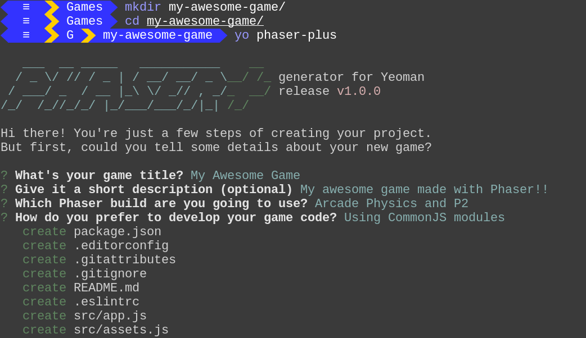

`generator-phaser-plus` Templates Collection
============================================


Here you will find the sample [Phaser][phsr] projects used as base templates for [`generator-phaser-plus`][gpp_]:

*   One with application scripts written as CommonJS modules, ideal for newcomers as well seasoned developers who want to start creating games at once.

*   Another one with scripts written as ECMAScript modules, for more skilled developers willing to test the latest and future JavaScript features using Phaser. Includes [Babel][babl] to compile and bundle scripts written in ECMAScript 2015+ syntax into scripts compatible with today's browsers and devices.

Both projects provide the same sample game, including only the essential features to start developing games right away.

>   Note: All projects are configured to use the Phaser CE libraries.


Batteries Included
------------------

All projects are ready to roll, including the following tools under the hood:

*   [Gulp][gulp] task manager, to handle development and distribution tasks, with alternative npm scripts.

*   [BrowserSync][bsnc] for cross-device testing.

*   [Browserify][brsy] for easier management of components and dependencies.

*   [ESLint][eslt] for code quality check.


How do I use these sample projects?
-----------------------------------

Ideally, you should use `generator-phaser-plus` to bootstrap new game projects. The generator is capable of creating projects with the same features you see here.



Just install it, using `npm install --global generator-phaser-plus`.

Otherwise, you can contribute with bug fixes and features you'd like to see added to `generator-phaser-plus`, just fork this repository, following the instructions below and submitting a pull request.


Development Instructions
------------------------

First off all, clone the generator repository locally and checkout the `templates` branch using Git:

```
git clone https://github.com/rblopes/generator-phaser-plus.git
cd generator-phaser-plus/
git checkout templates
```

Then, `cd` into any directory of your choice, install and manage tasks and dependencies using npm or Gulp, as you're used to with any game project created with `generator-phaser-plus`.

```sh
cd commonjs   # Example: edit the 'CommonJS' project.
npm install   # Installs the required project dependencies.
npm start     # or `gulp dev`: Launches the game in development mode.
npm run dist  # or `gulp dist`: Prepares the game for distribution.
npm run clean # or `gulp clean`: Deletes build files.
```

>   When submitting a pull request, don't forget to set the base branch to `templates` on the submission form.


License
-------

This software is distributed under the terms of the [MIT License](LICENSE).


<!-- Links -->

[phsr]: http://phaser.io/
[eslt]: http://eslint.org/
[gulp]: http://gulpjs.com/
[babl]: https://babeljs.io/
[brsy]: http://browserify.org/
[bsnc]: http://www.browsersync.io/
[gpp_]: https://github.com/rblopes/generator-phaser-plus
