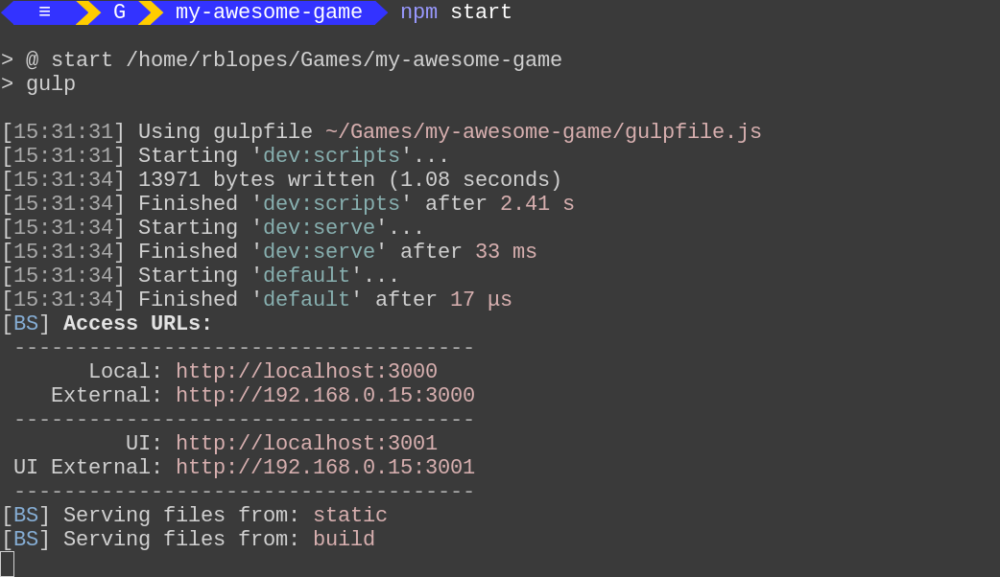
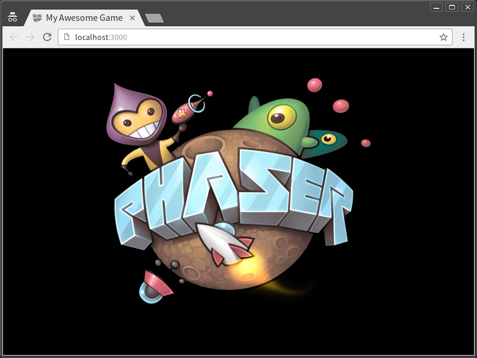
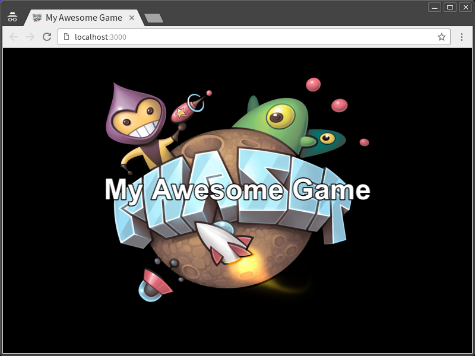
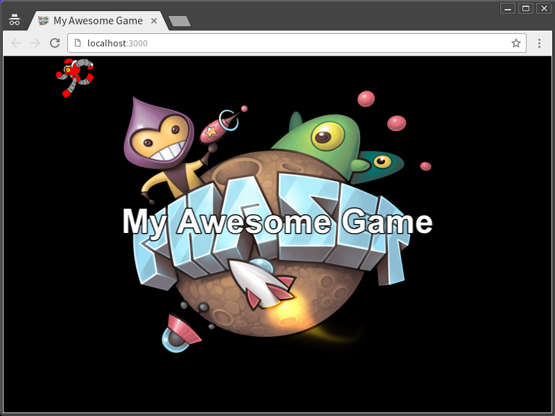
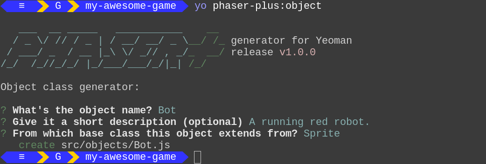
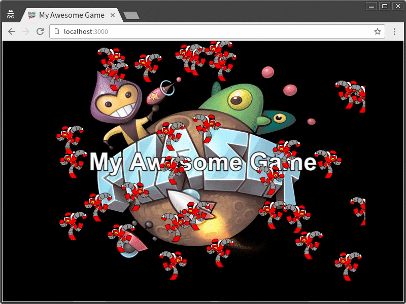
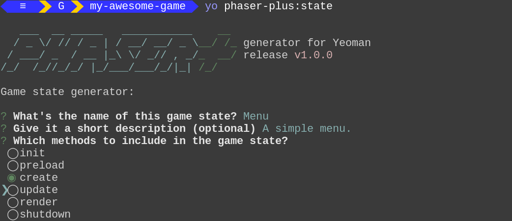
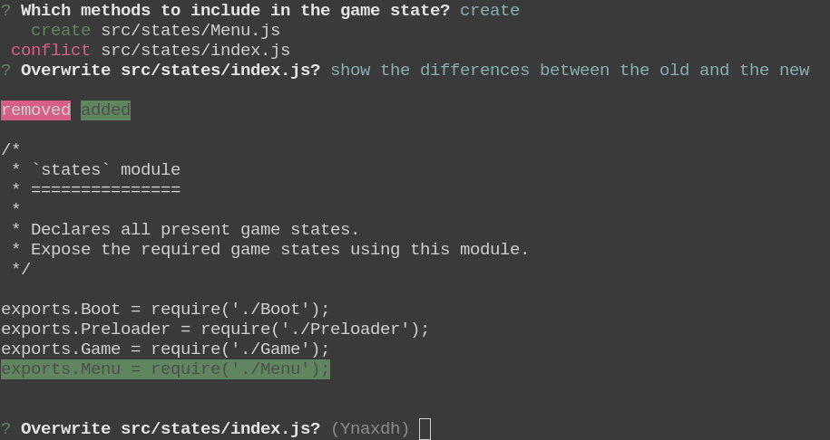
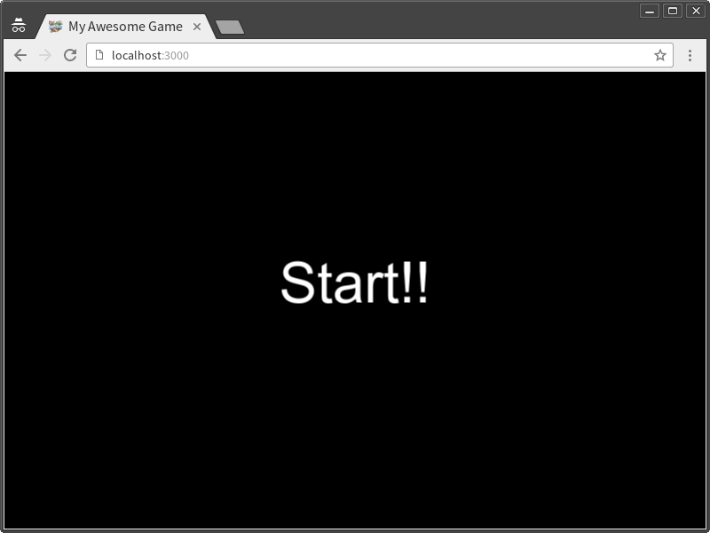

Quick Start Guide
=================

Hi there! Thanks for trying out `generator-phaser-plus`. This program is a [Yeoman][yo__] plugin, an utility that will help you creating Web game projects developed using the fabulous [Phaser Game Framework][phsr], including helpful features to solve some common tasks.

At the end of this guide, you will gain some understanding of how to create and manage your game projects using this generator.

To complete this tutorial, we assume you have:

*   A properly installed and configured [Node.js][node] environment with [npm][npm_].

*   Some understanding of how a command prompt or terminal emulator work. `generator-phaser-plus` is a program operated through a command-line interface. From here on, I'll be referring to it only as the "Terminal".

If you haven't installed Yeoman and `generator-phaser-plus` yet, just read the instructions at the "[Using `generator-phaser-plus`][___1]" page.


Bootstrapping a Game Project
----------------------------

With the necessary packages installed, it's time to begin creating your game project. But before we do that, just a few more commands:

```
mkdir my-awesome-game                   # (1)
cd my-awesome-game                      # (2)
yo phaser-plus                          # (3)
```

1.  Create a directory to keep the contents of your game project, to avoid them from overlapping with documents and other files. Of course, replace `my-awesome-game` with anything of your liking.

2.  Enter the directory you have just created.

3.  Finally, run the generator using Yeoman to begin creating your game project.

The generator will ask about a few details of your new game project. Fill in the questions, answering each one typing `[Enter]`.


After the last question, the generator will create the project contents and take care of installing, the necessary packages to begin the game development. If all goes well, your new game project is ready to start running.

>   Note: For this tutorial, we will use the "CommonJS" template option.


First Steps
-----------

Your new project comes with a tiny sample game, ready for editing. To test it, just type the following command in the Terminal:

```
npm start
```

Running this command starts your project in development mode. A few messages will be written in the Terminal, telling about some tasks running on the background.

Basically, the development mode comprises two tasks:

*   It monitors the application scripts for changes, triggering the necessary updates when they occur. Those scripts are the ones responsible for setting up and defining your game logic and aspect.

*   Provides a basic local Web Server, making your game content and assets accessible only by you.



When the tasks first iteration complete, your game is ready to be viewed in your Web browser. By the way, it should automatically open, with a tab pointing to address `http://localhost:3000`. If that doesn't happen for some reason, you can just browse there to see your game working. A page with a rotating "Phaser"logo will appear.




Applying Your First Changes
---------------------------

Now is a good time to open your game project inside your preferred code editor or IDE. Projects created with `generator-phaser-plus` feature a live development environment, where you can edit your application scripts, make changes and check the results immediately.

To see how this works, open up the `Game.js` state, inside the `src/states/` directory of your project. Add the following code below, right after the "Logo"stuff, in the `create` function body:

```js
var caption = game.add.text(320, 240, 'My Awesome Game', {
  fill: 'white',
  font: '48px Arial',
  fontStyle: 'bold',
  stroke: 'black',
  strokeThickness: 3
});
caption.anchor.set(0.5);
```

That code should place a big "My Awesome Game" caption above the "Phaser" logo. Right after you save the script, the browser tab should refresh, displaying the updated game.



Let's try a little more. Add the following code to give some animation to that caption.

```js
// Add after the anchor adjustment of the text label.
game.add.tween(caption)
  .to({y: '+40'}, 500, 'Sine.easeInOut')
  .yoyo(true)
  .loop()
  .start();
```

Again, the changes should be applied after you save the script, and the caption should repeatedly move up and down on the screen.


Adding an Asset
---------------

Adding assets is really straightforward in Phaser, and using [Phaser Asset Packs][___2] to declare assets makes them easier to manage.

Let's add an animated sprite to the game. The image used for this step of the tutorial is the `running_bot.png`, from the [Phaser Examples Repository][___3], which can be found browsing the `examples/assets/sprites/` folder. Also, download the `running_bot.json` file, which we'll be using to give the robot it's running animation. Copy both the image and JSON files into the `static/assets/` directory, inside your project.

To start using that asset, modify the `src/assets.js` module. The script, after you modify it, should look like in the code excerpt below.

```js
// -- General assets used throughout the game.
module.exports.game = [{
  key: 'phaser',
  type: 'image'
}, {
  key: 'running_bot',                   // Add the running bot texture and
  type: 'atlasJSONArray'                // its atlas metadata.
}];
```

Just that, and the animated sprite is ready for use. Go back to the `Game.js` script, and add the following line to display the sprite.

```js
game.add.sprite(0, 0, 'running_bot');
```



A little red robot should appear at the top left corner of the game canvas. It's only a still frame, though, there's no animation for it yet. We are going to fix this in a moment.


Creating a New Extended Game Object (Prefab)
--------------------------------------------

One recurring task when developing a game is creating special objects called "prefabs". Prefabs are premade reusable components, providing features not found when using regular game objects.

Programming a game in JavaScript with Phaser is not different, and to speed up things a little, `generator-phaser-plus` offers a special sub-generator for authoring prefabs, filling a template script with your desired content and putting it in the right place to keep your project organized.

This time, open up a second Terminal session, to keep the first one with the Web server running, and find again your project directory. Run the object sub-generator typing the following command:

```
yo phaser-plus:object
```



Give the questions the following answers:

*   **What's the object name**: `Bot`
*   **Give a brief description (optional)**: A running red robot.
*   **From which base class this object extends from?**: Choose `Sprite`

A new `Bot.js` script will be created in the `src/objects/` directory. Open it up and modify the code to look like in the following example:

```js
module.exports = Bot;

function Bot(game, x, y) {
  Phaser.Sprite.call(this, game, x, y, 'running_bot');

  // Set the anchor point so coordinates are relative to the robot feet.
  this.anchor.set(0.5, 1);

  // Set up the robot animation.
  this.animations.add('running', null, 20, true);
}
Bot.prototype = Object.create(Phaser.Sprite.prototype);
Bot.prototype.constructor = Bot;

Bot.prototype.run = function () {
  this.play('running');
};
```

Inside the `Bot` function, we tell Phaser this is our extended sprite object. It borrows the parameters which are, in order, the current running game instance, the `(x, y)` coordinates inside the game world, and the last tells which texture Phaser will use to draw the sprite on the screen, in our case, the red robot. We also adjust the anchor point of the sprite to be relative with the robot feet and register the running animation for use later.

Then, we replace the stub `update` method, renaming it to `run`, and instruct it to play the 'running' animation when called.

To use the `Bot` sprite inside the game, open again `Game.js` and import the script placing the following line at the top, right after the 'Logo' importing line.

```js
var Bot = require('../objects/Bot');    // Import the 'Bot' prefab.
```

And now, to add a pack of robots running around the game world, copy the
following lines inside the `create` function, replacing the previous
`game.add.sprite(0, 0, 'running_bot')` line:

```js
var bots = game.add.group();
for (var i = 0; i < 30; ++i) {
  var bot = bots.add(new Bot(game, game.world.randomX, game.world.randomY));
  bot.scale.x = game.rnd.sign();      // randomly flips a bot sprite.
  bot.run();
}
```




Adding a State
--------------

In Phaser, a "State" is the object that defines the overall aspect of a running game scene, providing the user interface and updating game logic. To create game states fast and easily using `generator-phaser-plus`, there is the `state` sub-generator that, not only creates the stub state module, but also updates the states index module, which conveniently declares all states used by your Phaser game. This way, you can start editing your new game state and check the results right away.

To begin creating a new game state, just run this command in the Terminal:

```js
yo phaser-plus:state
```



Let's create a simple Menu screen.

*   **What's the name of this game state?**: `Menu`
*   **Give it a short description (optional)**: A simple menu.
*   **Which methods to include in the game state?**:
    *   Check (or leave checked) the `create` option,
    *   Uncheck `update`,
    *   Leave the other options unchecked.

To choose the options on the third question, highlight one using the arrow keys up and down, and use the space bar to check or uncheck an option.

For a brief moment, the sub-generator will interrupt its job, asking you if it should update the states index. You can just accept the changes typing `[Enter]` to say "Yes" or check what changes are being made typing `[D]` and `[Enter]`.



Now that you added a new state, you should make a few changes in your game before using it. Open up the `Preloader.js` state script, located in the `src/states/` directory. In the `create` function, there is a line telling Phaser to start the `Game` state (`game.state.start('Game');`). Instead, you want to route Phaser to use the new `Menu` state. Just modify that line to look like this.

```js
game.state.start('Menu');               // Change 'Game' to 'Menu'.
```

After you save that script, the game canvas becomes empty — because we did not add anything to the new state yet.

Open the `Menu.js` script. Add the code below, inside the `create` function. For now, we are going to use a regular text label to mimic a menu button.

```js
// Create the text label which will act as the menu button.
var startButton = game.add.text(320, 240, 'Start!!', {
  fill: 'white',
  font: '64px Arial'
});
// Change the label orientation relative to its middle center.
startButton.anchor.set(0.5);
// Enable input events, like mouse clicks.
startButton.inputEnabled = true;
// When clicking the label, go to the next game state.
startButton.events.onInputUp.add(function () {
  game.state.start('Game');
});
```

After you save the state script, the text label should appear on the black canvas. After you click it, Phaser will show the `Game` state as before.




That concludes our "Quick Start Guide". It doesn't ends here, though. Now it's your turn! Go make awesome HTML5 games with Phaser!

<!--  -->

[___1]: generator.md
[___2]: asset-packs.md
[___3]: https://github.com/photonstorm/phaser-examples/

[phsr]: http://phaser.io/
[yo__]: http://yeoman.io/
[node]: https://nodejs.org/
[npm_]: https://www.npmjs.com/
